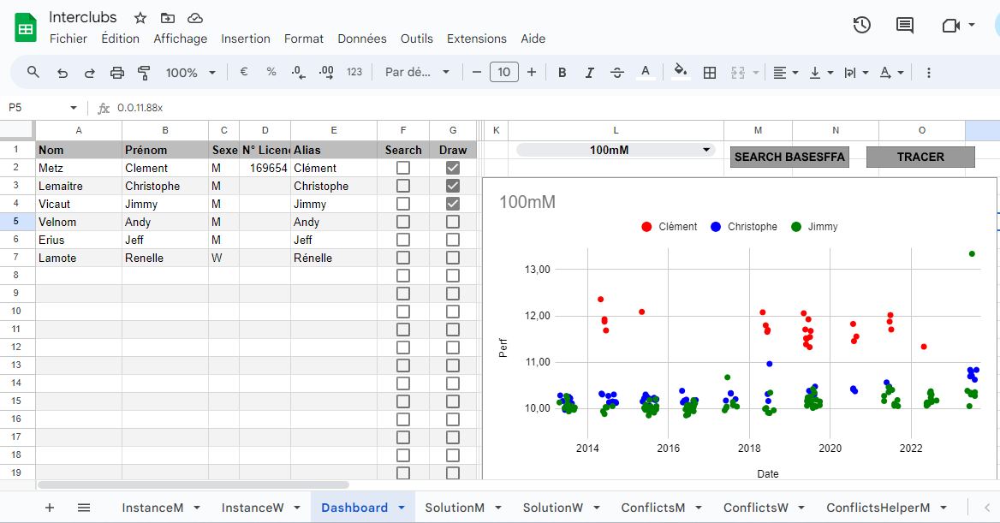

# SprintDashboard

SprintDashboard est un projet d'analyse de données de performances sportives à destination des clubs d'athlétisme français. Ce projet repose sur une feuille Google sheets propriétaire. Merci de contacter le développeur pour obtenir une version d'essai.

## Analyse de performances

On se rend dans l'onglet Dashboard :

  

### Tableau des athlètes

On renseigne les informations des athlètes à afficher, nom, prenom, sexe, un numéro de licence facultatif pour éviter les homonymies et un alias qui sera utilisé par le graphique. On coche la case "Search" pour préparer la recherche. Une fois que tous les athlètes sont renseignés, on clique sur "SEARCH BASESFFA". Le script met un certain temps à tourner (une vingtaine de secondes par athlète). Le script décoche automatiquement la case "Search" à chaque athlète trouvé. Une mise à jour future permettra d'accélérer le traitement et d'alléger la feuille.

### Affichage des données

Une fois les données chargées, on sélectionne les athlètes desquels afficher les performances grâce aux cases "Draw". On choisit ensuite une épreuve grâce au menu déroulant, puis on clique sur "TRACER". Le graphique se met à jour.